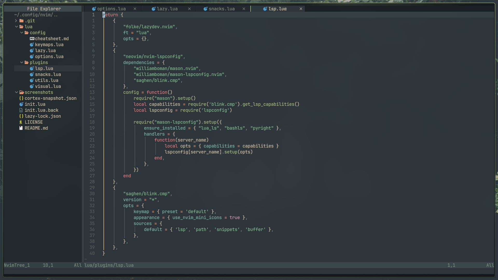
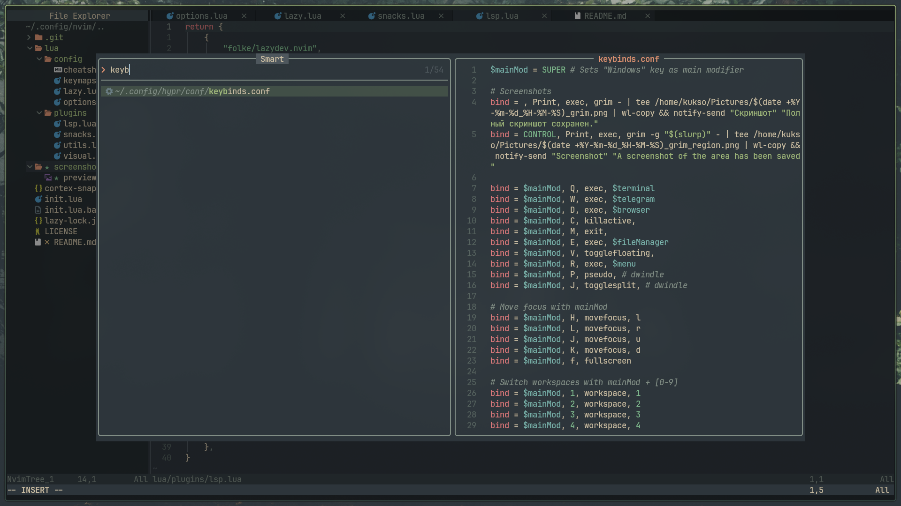

# kukso-nvim-dots

# Features
Smart search
Cheat sheet
Theme selector

# Plugins
Plugin manager: lazy.nvim
Utilities: snacks.nvim, mini.nvim, mini.icons
Lsp & completion: nvim-lspconfig blink.cmp, mason.nvim, mason-lspconfig.nvim, lazydev.nvim
Interface: dracula.nvim, everforest, themery.nvim, transparent.nvim, bufferline.nvim, nvim-web-devicons
Navigation & syntaxis: nvim-tree.lua, nvim-treesitter, nvim-navic

# Dependencies
System: neovim, git, make, unzip, gcc
Fonts: JetBrainsMono Nerd Font
